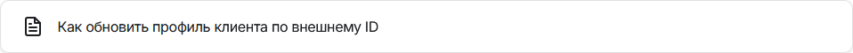

>Предлагаемые изменения (в файле есть коментарии с отредактированными местами) 
>1. На странице предлагается два варианта настройки маршрутизации тредов: первый - с помощью программы настройки, т.е. GUI, второй - с помощью API. И если обратить внимание на правый сайдбар, то там есть переход только на второй вариант настройки, и то, в формате предложения альтернативного варианта. Для пользователя с монитором меньше 27 дюймов или если браузер закреплён на половине\четверти экрана было бы удобнее иметь быстрый переход на оба варианта. Соответственно, для автоматического наполнения сайдбара при генерации страницы в Docusaurus необходимо добавить ещё один заголовок второго уровня.
>2. Если посмотреть на правый сайдбар, то можно обратить внимание, что заголовки тем написаны в двух разных стилях. Было бы неплохо заголовки каждой темы писать в едином стиле.
>3. Неправильная ссылка по кнопке "Как обновить профиль клиента по внешнему ID", заменил на корректную.
>4. Возможно, при нажатии кнопки "Запрос в поддержку" не стоит предлагать перейти в почтовый клиент, а открывать отдельное окно\вкладку для описания возникшего вопроса. И уже в ответ на это обращение присылать пользователю предварительное письмо с регистрацией заявки. 

<!-- Меняем заголовок для единого стиля -->
# Маршрутизация тредов на персонального менеджера

Настроить маршрутизацию тредов для того, чтобы конкретные клиенты попадали в персональную очередь только к своим персональным менеджерам (агентам) можно двумя способами: с помощью АРМ администратора и с помощью API.

<!-- Добавляем новый заголовок второго уровня и введение -->
## Назначение персонального менеджера для клиента через АРМ администратора

1. В рабочем месте администратора на странице **Сегменты** создайте сегмент с параметром **Персональный менеджер**.

2. Установите данному сегменту наивысший приоритет.
3. На странице **Маршруты** создайте маршрут для данного сегмента: в точке маршрута выберите параметр **Персональный менеджер**.

4. При создании треда клиента из SDK веб-виджета или мобильного приложения со стороны родительского приложения в ClientData необходимо передать параметр `personal_manager` со значением в виде логина агента, на которого необходимо маршрутизировать клиента.

>Такая связка клиента с персональным менеджером сохранится для любого его следующего треда, пока не придет пустое значение или новое значение логина.

<!-- Два раза подряд идёт "чат-бот", чуть стоит переформулировать -->
5. Если для обработки обращений вы используете чат-бота, то в процессе общения с клиентом чат-бот может получить информацию о его персональном менеджере, например, из сторонней CRM-системы. При переводе треда с чат-бота в очередь к операторам чат-бот может в структуре `segmentationInfo` передать параметр `personal_manager` со значением в виде логина агента, на которого необходимо маршрутизировать клиента.

>Такая связка клиента с персональным менеджером будет действовать только для текущего треда.

Если по клиенту одним из вышеперечисленных способов была передана информация о персональном менеджере, то тред клиента распределится по настроенному маршруту для персональных менеджеров на агента с соответствующим логином.

<!-- Также меняем заголовок второго уровня для единого стиля -->
## Назначение персонального менеджера для клиента с использованием API

В нашем внешнем API есть методы обновления данных о клиенте.

<!-- Указываем корректную ссылку для работы с API -->

<!-- Два раза подряд идёт обращение "вы" -->
Если вы используете CRM, то можете реализовать вызов наших методов для обновления информации о персональном менеджере клиента.

Также вы можете реализовать универсальную команду, с помощью которой можно назначить персонального менеджера. Например:
1. Клиент создает тред, но данных о персональном менеджере у него нет.
2. Агент в процессе общения вызывает команду и указывает логин персонального менеджера.
3. При следующем обращении клиента его тред распределится по правилам персональной маршрутизации.

[](mailto:support@edna.ru?subject=%D0%97%D0%B0%D0%BF%D1%80%D0%BE%D1%81%20%D0%B2%20%D0%BF%D0%BE%D0%B4%D0%B4%D0%B5%D1%80%D0%B6%D0%BA%D1%83&body=%D0%97%D0%B4%D1%80%D0%B0%D0%B2%D1%81%D1%82%D0%B2%D1%83%D0%B9%D1%82%D0%B5!%0A%0A%D0%A1%D1%82%D1%80%D0%B0%D0%BD%D0%B8%D1%86%D0%B0%2C%20%D0%BD%D0%B0%20%D0%BA%D0%BE%D1%82%D0%BE%D1%80%D0%BE%D0%B9%20%D0%B2%D0%BE%D0%B7%D0%BD%D0%B8%D0%BA%D0%BB%D0%B8%20%D0%B2%D0%BE%D0%BF%D1%80%D0%BE%D1%81%D1%8B%3A%20https%3A%2F%2Fdocs-chatcenter.edna.ru%2Fdocs%2Fadditional-function%2Fpersonal-manager%2F%0A%0A%D0%9E%D0%BF%D0%B8%D1%81%D0%B0%D0%BD%D0%B8%D0%B5%20%D0%BF%D1%80%D0%BE%D0%B1%D0%BB%D0%B5%D0%BC%D1%8B%3A%0A%5B%D0%9E%D0%BF%D0%B8%D1%88%D0%B8%D1%82%D0%B5%20%D0%B2%D0%B0%D1%88%D1%83%20%D0%BF%D1%80%D0%BE%D0%B1%D0%BB%D0%B5%D0%BC%D1%83%20%D0%B7%D0%B4%D0%B5%D1%81%D1%8C%5D%0A%0A%D0%A1%20%D1%83%D0%B2%D0%B0%D0%B6%D0%B5%D0%BD%D0%B8%D0%B5%D0%BC%2C%0A%5B%D0%92%D0%B0%D1%88%D0%B5%20%D0%B8%D0%BC%D1%8F%5D)
