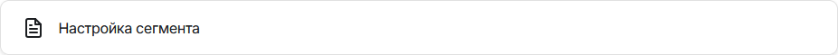
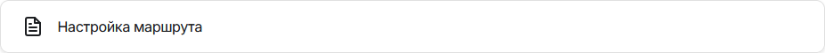

>Предлагаемые изменения (в файле есть коментарии с отредактированными местами) 
>1. На странице предлагается два варианта настройки маршрутизации тредов: первый - с помощью АРМ администратора, второй - с помощью API. И если обратить внимание на правый сайдбар, то там есть переход только на второй вариант настройки, и то, в формате предложения альтернативного варианта. Для пользователя с монитором меньше 27 дюймов или если браузер закреплён на половине\четверти экрана было бы удобнее иметь быстрый переход на оба варианта. Соответственно, для автоматического наполнения сайдбара при генерации страницы в Docusaurus необходимо добавить ещё один заголовок второго уровня.
>2. Если посмотреть на правый сайдбар, то можно обратить внимание, что заголовки тем написаны в двух разных стилях. Было бы неплохо заголовки тем писать в едином стиле.
>3. Неправильная ссылка по кнопке "Как обновить профиль клиента по внешнему ID", ведёт на настройку маршрута из п.3, заменил на корректную.
>4. Возможно, при нажатии кнопки "Запрос в поддержку" не стоит предлагать перейти в почтовый клиент, а открывать отдельное окно\вкладку для описания возникшего вопроса. И уже в ответ на это обращение присылать пользователю предварительное письмо с регистрацией заявки.
>5. В тексте использовал оформление информационных блоков для Docusaurus, но в гитхабе их отображение не поддерживается.

<!-- Меняем заголовок для единого стиля -->
# Маршрутизация тредов на персонального менеджера

<!-- Корректируем введение для упоминания двух вариантов настройки -->
Администратор может настроить маршрутизацию тредов так, чтобы конкретные клиенты попадали в персональную очередь только к своим персональным менеджерам (агентам). Настройка производится в интерфейсе АРМ администратора или с использованием API.

<!-- Добавляем новый заголовок второго уровня -->
## Назначение персонального менеджера для клиента через АРМ администратора

1. В рабочем месте администратора на странице **Сегменты** создайте сегмент с параметром **Персональный менеджер**.

2. Установите данному сегменту наивысший приоритет.
3. На странице **Маршруты** создайте маршрут для данного сегмента: в точке маршрута выберите параметр **Персональный менеджер**.

4. При создании треда клиента из SDK веб-виджета или мобильного приложения со стороны родительского приложения в ClientData необходимо передать параметр `personal_manager` со значением в виде логина агента, на которого необходимо маршрутизировать клиента.

<!-- Оформление для Docusaurus -->
:::info

Такая связка клиента с персональным менеджером сохранится для любого его следующего треда, пока не придет пустое значение или новое значение логина.

:::

<!-- Стоит переформулировать предложение, упростить его -->
5. Чат-бот может получать информацию о его персональном менеджере, например, из сторонней CRM-системы. При переводе треда с чат-бота в очередь к операторам чат-бот может в структуре `segmentationInfo` передаётся параметр `personal_manager` со значением в виде логина агента, на которого необходимо маршрутизировать клиента.

<!-- Оформление для Docusaurus -->
:::info

Такая связка клиента с персональным менеджером будет действовать только для текущего треда.

:::

<!-- Также меняем заголовок второго уровня для единого стиля и добавляем введение -->
## Назначение персонального менеджера для клиента с использованием API

Используйте методы API, чтобы обновить данные о клиенте. Если в вы используете CRM, то можете реализовать вызов методов API для обновления информации о персональном менеджере клиента.

<!-- Указываем корректную ссылку для работы с API -->

Также вы можете реализовать универсальную команду, с помощью которой можно назначить персонального менеджера.

>Пример:
>1. Клиент создает тред, но данных о персональном менеджере у него нет.
>2. Агент в процессе общения вызывает команду и указывает логин персонального менеджера.
>3. При следующем обращении клиента его тред распределится по правилам персональной маршрутизации.

<!-- Оформление для Docusaurus -->
:::tip

Для помощи в реализации универсальной команды обратитесь в службу поддержки edna.

:::
